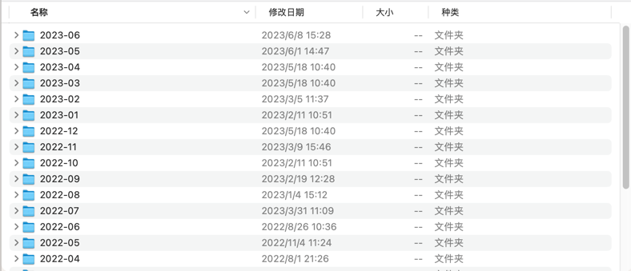

# Organize-MAC-WeChat-files

## 效果

### 整理后的文件

## 功能

该程序是为了解决Mac版微信中接收和发送的文件按联系人分类、文件夹命名混乱的问题。它能够将所有接收和发送的文件以及图片移动至指定文件夹，并按日期进行分类。

| 文件状态 | 操作 | status |
|:------------:|:-------:|:---------:|
| 相同名称，不同MD5 | 重命名并复制 | 1 |
| 不同名称，不同MD5 | 直接复制 | 3 |
| 不同名称，相同MD5 | 直接复制 | 3 |
| 相同名称，相同MD5 | 跳过 | 2 |

## 使用说明

在使用前，需要正确设置以下三个路径：

1. `root_dir`: 微信文件所在的路径，末尾不需要加 `/`。

    示例: 
    ```python
    root_dir = '/path/to/your/wechat/files'
    ```

2. `transit_path`: 文件的中转站路径，末尾需要加 `/`。

    示例:
    ```python
    transit_path = '/path/to/your/transit/path/'
    ```

3. `target_path2`: 用于存储复制过来的文件的目标目录，末尾需要加 `/`。

    示例:
    ```python
    target_path2 = '/path/to/your/target/path/'
    ```
请务必将以上路径替换为实际使用的路径。

## 特色

本程序对待备份的文件和已有的文件进行了名称和MD5值对比，从而避免文件的遗漏或重复备份。安全可靠，备份更省心。


