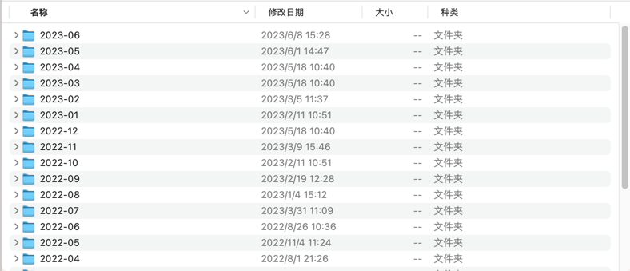

# Organize-MAC-WeChat-files

## 效果

### 整理后的文件



## 功能

这个脚本用于整理 Mac 版微信接收和发送的文件。它会扫描微信目录下的 `File` 和 `OpenData` 文件夹，把文件复制到目标目录，并按月份归档。

归档过程中会按 MD5 做内容去重，避免同一份文件被重复备份。

| 文件状态 | 操作 |
|:--:|:--:|
| 目标目录已有相同 MD5 | 跳过 |
| 同月份存在同名但不同内容的文件 | 使用 MD5 后缀改名后复制 |
| 目标目录没有相同内容且没有同名冲突 | 直接复制 |
| 文件最近还在变动 | 跳过，避免复制未写完的文件 |

## 使用说明

建议先使用 `--dry-run` 预演，确认计划没有问题后再正式执行。

```bash
python archive_wechat_file.py \
  --root-dir "/path/to/your/wechat/files" \
  --target-dir "/path/to/your/archive" \
  --dry-run
```

正式执行：

```bash
python archive_wechat_file.py \
  --root-dir "/path/to/your/wechat/files" \
  --target-dir "/path/to/your/archive"
```

默认会跳过最近 5 秒内修改过的文件，减少复制微信仍在写入的半截文件的风险。可以用 `--stable-seconds` 调整：

```bash
python archive_wechat_file.py \
  --root-dir "/path/to/your/wechat/files" \
  --target-dir "/path/to/your/archive" \
  --stable-seconds 10
```

脚本会把日志写到目标目录下的 `archive_wechat_file.log`。也可以通过 `--log-file` 指定日志路径。

如果不想每次输入参数，也可以在 `archive_wechat_file.py` 顶部填写：

```python
root_dir = "/path/to/your/wechat/files"
target_path2 = "/path/to/your/archive"
```

`transit_path` 已不再需要。重名文件会直接复制到最终目标路径，不再经过中转目录。

## 安全建议

- 第一次运行前先使用 `--dry-run`。
- 正式归档前尽量退出微信，或把 `--stable-seconds` 调大。
- 不要把目标目录放在微信源目录内部，避免重复扫描。
- 定期检查 `archive_wechat_file.log`，确认没有失败记录。
